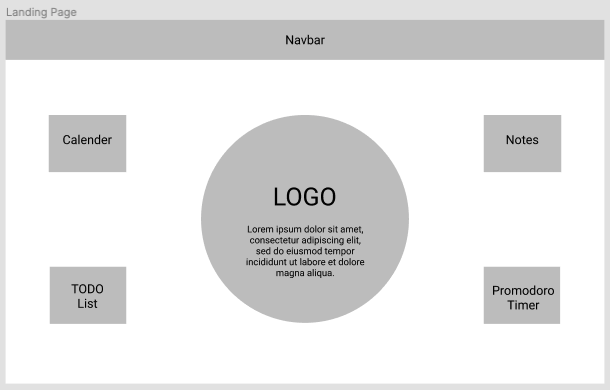
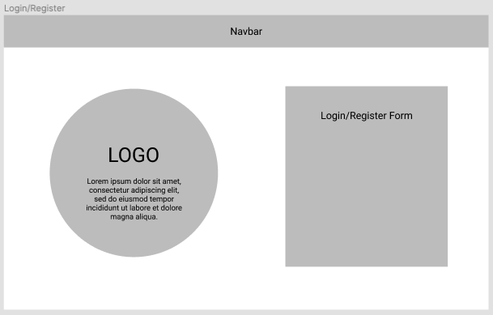
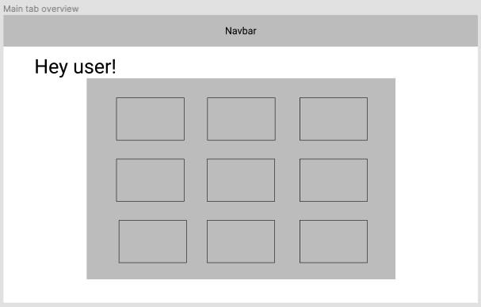
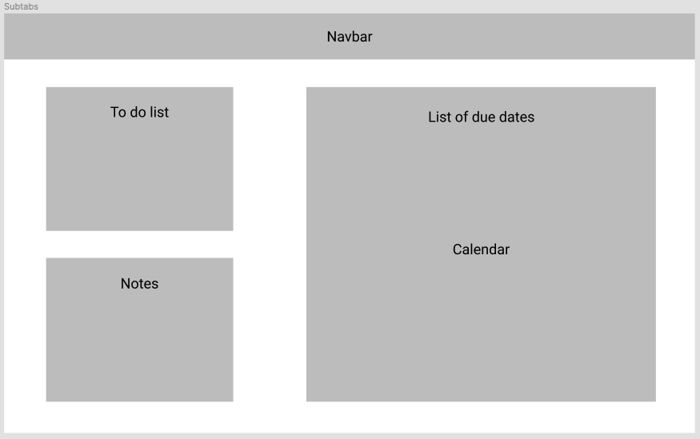
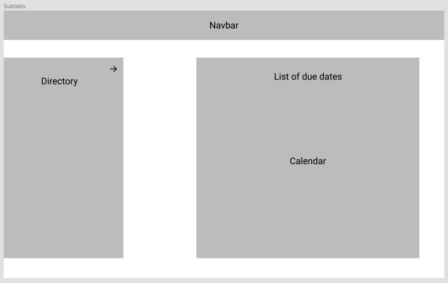
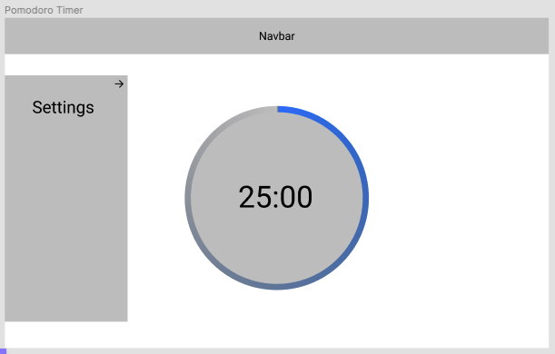

# Project Plan

Pod Members: **Stephanie D., Abhiraj C., Gevork M.**

## Problem Statement and Description

### Problem Statement
Managing large-scale projects or assignments is difficult due to complex scope and competing priorities. Our goal is to provide a versatile web planning tool that allows users to easily view their deadlines/deliverables by organizing large assignments into smaller, digestible tasks.

### Description
The purpose of this app is to provide users a platform that helps users be more productive and at the same time reminds them to take breaks while working. Key features include adding main tabs and subtabs for each different category of work and using the pomodoro timer to further increase productivity. Each tab contains a calendar side by side with daily/weekly to-do lists, a notes section, and a running timer for the pomodoro in nav bar.

## User Roles and Personas

### User Roles
- Individual: a user who wants to be productive in their daily lives with the help of our application.

### User Personas
- Billy is a sophomore who goes to UCLA. Billy is a Computer Science student and wants to manage the different projects/assignments along with preparing for technical interviews. In order to be productive and not procrastinate, Billy wants to have a central manager which has all his notes and information for each of his classes.
 
- Susan is a middle aged woman working as a project manager. Susan’s team is undertaking a large project and wants to have an effective management system to keep track of the various moving parts. Susan needs to create and share a tool with a work-rest daily schedule, kanban-style todos and overview for future meetings.

## User Stories

1. As a user, I want to be able to organize different projects, classes, and assignments neatly and in an easy to read way.
2. As a user I want to be able to create my own account to store my private information.
3. As a user I want to be able to login to view my information.
4. As a user I want to see my profile page and my projects/assignments.
5. As a user I want to be able to add events to my calendar which are separated based on my projects.
6. As a user I want to be able to create a TODO list which I can add tasks to and remove tasks when I complete them.
7. As a user I want to be able to nest simpler tasks in more complex tasks in order to make them easier to digest.
8. As a user I want to be able to create notes in each project in order to have them better organized. 
9. As a user I want to be able to set a work timer to allow me to take needed breaks to increase productivity. 
10. As a user I want to be able to customize my timer settings to meet my own personal needs. 

## Pages/Screens

Landing page                         
:-------------------------:
 

Login/Register page             
:-------------------------:
 

Tabs Overview page    
:-------------------------:
  

Tab page            
:-------------------------:
 

Tab page w/ directory           
:-------------------------:
 

Pomodoro Timer page
:-------------------------:
 

## Data Model

### users
Name |  Type  | Description
:-------------------------:|:-------------------------:|:-------------------------:
id | SERIAL | primary key
email | VARCHAR(70) | email of user, unique
password | TEXT | hashed user password
first_name | VARCHAR(50) | user's first name
last_name | VARCHAR(50) | user's last name
is_admin | BOOLEAN | default false
created_at | TIMESTAMP | when account was created

### main_tabs
Name |  Type  | Description
:-------------------------:|:-------------------------:|:-------------------------:
id | SERIAL | primary key
user_id | INTEGER | foreign key to users
name | VARCHAR(30) | name of main tab
created_at | TIMESTAMP | when main tab was created

### subtabs
Name |  Type  | Description
:-------------------------:|:-------------------------:|:-------------------------:
id | SERIAL | primary key
main_id | INTEGER | foreign key to main tab, possibly null
sub_id | INTEGER | foreign key to sub tab, possibly null
created_at | TIMESTAMP | when sub tab was created

### tasks
Name |  Type  | Description
:-------------------------:|:-------------------------:|:-------------------------:
id | SERIAL | primary key
sub_id | INTEGER | foreign key to sub tab
details | VARCHAR(40) | task description
completed_at | TIMESTAMP | date the task was completed
created_at | TIMESTAMP | when task was created

### notes
Name |  Type  | Description
:-------------------------:|:-------------------------:|:-------------------------:
id | SERIAL | primary key
sub_id | INTEGER | foreign key to sub tab
title | VARCHAR(20) | notes title
details | TEXT | notes description
created_at | TIMESTAMP | when notes was created

### calendar
Name |  Type  | Description
:-------------------------:|:-------------------------:|:-------------------------:
id | SERIAL | primary key
sub_id | INTEGER | foreign key to sub tab
event | VARCHAR(20) | title of event
date | TIMESTAMP | date/deadline of event
created_at | TIMESTAMP | when calendar was created

## Endpoints

### auth
CRUD |  HTTP Verb  | Description | User stories
:-------------------------:|:-------------------------:|:-------------------------:|:-------------------------:
Create | POST | adding a user | 2
Create | POST | loggin in a user | 3
Read | GET | retrieving user information | 4

### tabs
CRUD |  HTTP Verb  | Description | User stories
:-------------------------:|:-------------------------:|:-------------------------:|:-------------------------:
Create | POST | adding a new main tab | 1
Delete | DELETE | deleting a main tab | 1
Read | GET | fetching list of main tabs | 4
Read | GET | fetch main tab based on main_id | 4
Create | POST | adding a new sub tab | 7
Delete | DELETE | deleting a sub tab | 7
Read | GET | fetching list of sub tabs | 4
Read | GET | fetching sub tab based on sub_id | 4

### todo 
CRUD |  HTTP Verb  | Description | User stories
:-------------------------:|:-------------------------:|:-------------------------:|:-------------------------:
Create | POST | adding a new todo | 6
Delete | DELETE | deleting a todo | 6
Read | GET | fetching list of todos | 4

### notes 
CRUD |  HTTP Verb  | Description | User stories
:-------------------------:|:-------------------------:|:-------------------------:|:-------------------------:
Create | POST | adding a new note | 8
Delete | DELETE | deleting a note | 8
Read | GET | fetching list of notes | 4

### calendar 
CRUD |  HTTP Verb  | Description | User stories
:-------------------------:|:-------------------------:|:-------------------------:|:-------------------------:
Create | POST | adding a new event | 5
Delete | DELETE | deleting an event | 5
Read | GET | fetching list of events | 4

***Completed our set up of our Issues, Milestones, and Project Board!***
